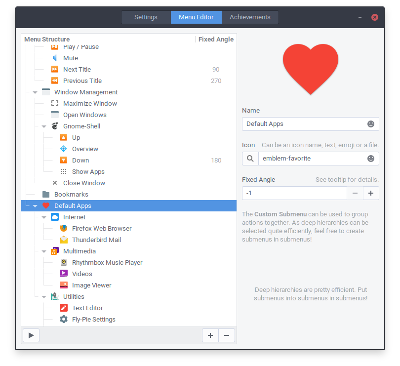
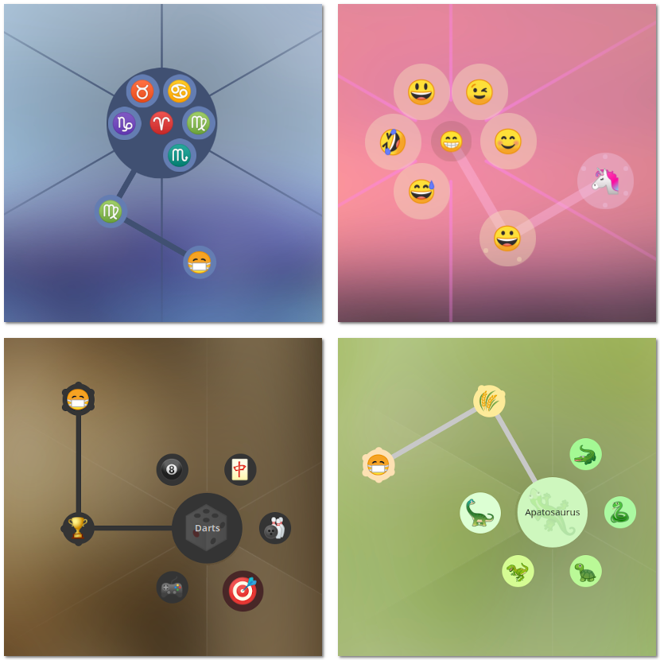

<p align="center"> 
  
</p>

[](https://github.com/Schneegans/Fly-Pie/actions)
[](metadata.json)
[](LICENSE)
[](cloc.sh)
[](cloc.sh)
[](https://extensions.gnome.org/extension/3433/fly-pie)

**Fly-Pie** is an attractive marking menu for Gnome Shell which can be used to launch applications, simulate hotkeys, open URLs and much more.
It features a continuous learning curve which lets you gradually lift-off from a grumpie menu rookie to a snappie menu pielot.
(You got it? Like pilot, but with a :cake:).

# Getting Started

<a href="https://youtu.be/U22VxoT-tNU"></a>

Fly-Pie is designed for people who have **one hand at the mouse** most of the time.
It is **not** designed to be used with a keyboard only; there are other applications which work better in this case (for example [kupfer](https://github.com/kupferlauncher/kupfer)).
Fly-Pie will also play nicely with **touch input**. 
While it might work already, a future version of Fly-Pie will be dedicated to add proper touch support.

Click the player image on the right to watch a trailer on YouTube!

## Features

_:construction: **Under Construction:** Fly-Pie is still under heavy development! For now, it has been only tested on **Ubuntu 20.04** and **Gnome Shell 3.36**. Whenever you encounter a :beetle: bug or have :tada: feature request, 
report this via [Github issues](https://github.com/schneegans/fly-pie/issues)._

The list below provides both, a high-level overview of Fly-Pie's current capabilities as well as a rough idea of planned features. 

- [X] Create as many menus as you want.
- [X] Bind menus to shortcuts.
- [X] Create as deep menu hierarchies as you want.
- [X] Two selection modes which can be used together:
  - [X] **Point-and-Click:** Select items by clicking anywhere in the corresponding wedge.
  - [X] **Marking-Mode:** Select items by drawing gestures.
- [X] **Live Preview:** See your configuration changes instantaneously.
- [X] Available Actions:
  - [X] **Launch Application:** Executes any given shell command.
  - [X] **Activate Shortcut:** Simulates a key stroke.
  - [X] **Insert Text:** Pastes some given text to wherever the cursor currently is.
  - [X] **Open URI:** Opens an URI with the default applications.
  - [X] **Open File:** Opens a file with the default applications.
- [X] Predefined Submenus:
  - [X] **Bookmarks:** Shows your commonly used directories.
  - [X] **Devices:** Shows connected devices.
  - [X] **Running Apps:** Shows the currently running applications.
  - [X] **Recent Files:** Shows your recently used files.
  - [X] **Frequently Used:** Shows your frequently used applications.
  - [X] **Favorites:** Shows your pinned applications.
  - [X] **Main Menu:** Shows all installed applications (This requires GMenu typelib to be installed. `sudo apt-get install gir1.2-gmenu-3.0` on Ubuntu).
- [X] D-Bus Interface:
  - [X] Open pre-configured menus via the D-Bus.
  - [X] Open custom menus via the D-Bus.
- [X] Make it available on [extensions.gnome.org](https://extensions.gnome.org/extension/3433/fly-pie).
- [ ] Translations:
  - [X] English
  - [ ] German
  - [ ] ...
- [ ] Proper touch support.
- [ ] Proper multi-monitor support.
- [ ] Cool appearance presets.
- [ ] Achievements!

## Installation

You can either install Fly-Pie from extensions.gnome.org, download a stable release from GitHub or clone the latest version directly with `git`.

### Installing from extensions.gnome.org

This is the most easy way to install Fly-Pie. Just head over to [extensions.gnome.org](https://extensions.gnome.org/extension/3433/fly-pie) and flip the switch! If you want to use a more up-to-date version of Fly-Pie, you can try one of the methods listed below.

### Downloading a Stable Release

Just [download the latest release](https://github.com/Schneegans/Fly-Pie/releases) and extract the contained directory to `~/.local/share/gnome-shell/extensions`.
Then restart Gnome Shell with <kbd>Alt</kbd> + <kbd>F2</kbd>, <kbd>r</kbd> + <kbd>Enter</kbd>.
Or logout / login if you are on Wayland.
Then you can enable the extension with the *Gnome Tweak Tool*, the *Extensions* application or with this command:

```bash
gnome-extensions enable flypie@schneegans.github.com
```

### Cloning the Latest Version with `git`

```bash
cd ~/.local/share/gnome-shell/extensions
git clone https://github.com/Schneegans/Fly-Pie.git
mv Fly-Pie flypie@schneegans.github.com
```

Then restart Gnome Shell with <kbd>Alt</kbd> + <kbd>F2</kbd>, <kbd>r</kbd> + <kbd>Enter</kbd>.
Or logout / login if you are on Wayland.
Then you can enable the extension with the *Gnome Tweak Tool*, the *Extensions* application or with this command:

```bash
gnome-extensions enable flypie@schneegans.github.com
```

## First Steps with Fly-Pie

If you installed and enabled Fly-Pie for the very first time, you can bring up the default menu with <kbd>Ctrl</kbd> + <kbd>Space</kbd>. If nothing happens, you can execute the following command and look for any errors.

```bash
journalctl -f -o cat | grep flypie -B 2 -A 2
```

When you open the settings dialog of Fly-Pie, you will be greeted with an interactive tutorial demonstrating effective usage patterns.
Here is a summary of the major hints to ease your path to become a master pielot:
* You can **click anywhere in an item's wedge**. It does not matter whether you click directly on an item or at the edge of your screen as long as you are in the same wedge.
* To enter **Marking Mode**, click and drag an item. As soon as you pause dragging or make a turn, the item will be selected. **This way you can select items with gestures!**
* Try remembering the path to an item. Open the menu and **draw the path with your mouse**. You can start with individual segments of the path, put you can also try to draw the entire path!
* You may find it more successful if you explicitly try to compose your gesture of straight parts. **Do not draw curvy paths but rather expressive zig-zag-lines!**


### Bake Your First Pie Menu!



The default menu may give you the opportunity to play around with Fly-Pie, but you should definitely define your own menus!

The configuration dialog of Fly-Pie has three pages. On the first page you can define its **appearance**, on the second you can **define your own menus**. The last one... well, we will come to this later!

With the play-button you can always open a **live-preview** of your menu.
Just play around with the options, most of it should be more or less self-explanatory.

### Tweak the Appearance Settings!

While there are not many presets included for now - this will happen in a future version - you can already create your own! There are quite some possibilities...



### Alternative Ways to Open Menus

There are two possibilities to open menus. Either via the configured shortcut or with a terminal command as described below. This second approach can be used in combination with other tools. Interesting companions are:
* [CustomCorner](https://extensions.gnome.org/extension/1037/customcorner/): Open menus by moving your mouse to one corner of your screen!
* [Easystroke](https://github.com/thjaeger/easystroke/wiki): X11 only, use mouse gestures to open menus!
* [xbindkeys](http://www.nongnu.org/xbindkeys/xbindkeys.html): X11 only, bind menus to your additional mouse buttons!


## Fly-Pie's D-Bus Interface

Fly-Pie has a D-Bus interface which allows not only to open configured menus via the commandline, but also to open completely custom-made menus defined with a JSON string.

### Opening Menus Configured with the Menu Editor

Use the following command to open a menu you configured with the Fly-Pie's Menu Editor.
The only parameter given to the `ShowMenu` method is the name of the menu.
There is also a similar method called `PreviewMenu` which will open the given menu in preview mode.

```bash
gdbus call --session --dest org.gnome.Shell --object-path /org/gnome/shell/extensions/flypie --method org.gnome.Shell.Extensions.flypie.ShowMenu 'My Menu'
```

### Opening Custom Menus via JSON

You can pass a JSON menu description to the `ShowCustomMenu` to show a custom menu. Here is an example showing a simple menu with two child elements:

```bash
gdbus call --session --dest org.gnome.Shell                            \
  --object-path /org/gnome/shell/extensions/flypie                     \
  --method org.gnome.Shell.Extensions.flypie.ShowCustomMenu            \
  '{"icon": "😀", "children": [                                        \
    {"name": "Rocket",   "icon":"🚀", "id":"a"},                       \
    {"name": "Doughnut", "icon":"🍩", "id":"b", "children": [          \
      {"name": "Cat",         "icon":"🐈"},                            \
      {"name": "Apatosaurus", "icon":"🦕"}                             \
    ]}                                                                 \
  ]}'
```

This JSON structure is quite simple. Each item may have the following properties:

* **`"name"`:** This will be shown in the center when the item is hovered.
* **`"icon"`:** Either an absolute path, an icon name (like `"firefox"`) or text. This is why we can use emoji for the icons!
* **`"id"` (optional):** Once an item is selected, this ID will be reported as part of the selection path. If omitted, the ID is the index of the child.
* **`"angle"` (optional, 0 - 359):** This forces the item to be placed in a specific direction. However, there is a restriction on the fixed angles. Inside a menu level, the fixed angles must be monotonically increasing, that is each fixed angle must be larger than any previous fixed angle.
* **`"children"` (optional):** An array of child items.
* **`"centered"` (only for root items, optional):** When set to `true`, the menu will be shown in the middle of the screen, else it will be shown at the mouse pointer.

The method will return an integer.
This will be either negative (Fly-Pie failed to parse the provided description, see [DBusInterface.js](common/DBusInterface.js) for a list of error codes) or a positive ID which will be passed to the signals of the interface.

There are two signals; `OnCancel` will be fired when the user aborts the selection in a menu, `OnSelect` is activated when the user makes a selection.
Both signals send the ID which has been reported by the corresponding `ShowCustomMenu` call, in addition, `OnSelect` sends the path to the selected item.

The path will be a string in the form of `"/1/0"`.
This example would mean that the first child of the second child of the root menu was selected (indices are zero-based).
If you assigned IDs to some of your items, their part of the path will be replaced by the ID.
In the example above, selecting `Apatosaurus` will yield `"/b/1"`.

You can use the following command to monitor the emitted signals:

```bash
gdbus monitor --session --dest org.gnome.Shell --object-path /org/gnome/shell/extensions/flypie
```

To see all available methods and signals you can introspect the interface:

```bash
gdbus introspect --session --dest org.gnome.Shell --object-path /org/gnome/shell/extensions/flypie
```

# Contributing to Fly-Pie

Whenever you encounter a :beetle: **bug** or have :tada: **feature request**, 
report this via [Github issues](https://github.com/schneegans/fly-pie/issues).

We are happy to receive contributions to Fly-Pie in the form of **pull requests** via Github.
Feel free to fork the repository, implement your changes and create a merge request to the `develop` branch.

Developing a Gnome Shell extension is not easy, as debugging possibilities are quite limited. One thing you should always do is to monitor Gnome Shells output for error or debug messages produced by Fly-Pie. This can be done like this:

```bash
journalctl -f -o cat | grep flypie -B 2 -A 2
```

## Branching Guidelines

The development of Fly-Pie follows a simplified version of **git-flow**: The `master` branch always contains stable code.
New features and bug fixes are implemented in `feature/*` branches and are merged to `develop` once they are finished.
When a new milestone is reached, the content of `develop` will be merged to `master` and a tag is created. In rare and critical cases, hotfixes for the latest release will be created in the `master` branch and merged back to `develop`.

## Git Commit Messages

Commits should start with a Capital letter and should be written in present tense (e.g. __:tada: Add cool new feature__ instead of __:tada: Added cool new feature__).
You should also start your commit message with **one** applicable emoji. This does not only look great but also makes you rethink what to add to a commit. Make many but small commits!

Emoji | Description
------|------------
:tada: `:tada:` | When you added a cool new feature.
:wrench: `:wrench:` | When you refactored / improved a small piece of code.
:hammer: `:hammer:` | When you refactored / improved large parts of the code.
:sparkles: `:sparkles:` | When you applied clang-format.
:art: `:art:` | When you improved / added assets like themes.
:rocket: `:rocket:` | When you improved performance.
:memo: `:memo:` | When you wrote documentation.
:beetle: `:beetle:` | When you fixed a bug.
:twisted_rightwards_arrows: `:twisted_rightwards_arrows:` | When you merged a branch.
:fire: `:fire:` | When you removed something.
:truck: `:truck:` | When you moved / renamed something.
