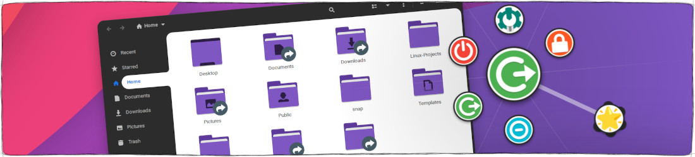

  

**Fly-Pie** is an attractive marking menu for GNOME Shell which can be used to launch applications, simulate hotkeys, open URLs and much more.
It features a continuous learning curve which lets you gradually lift-off from a grumpie menu rookie to a snappie menu pielot.
(You got it? Like pilot, but with a :cake:).

Fly-Pie lets you open _marking-menus_ of arbitrary depth via keyboard shortcuts.
When using Fly-Pie, there are two selection modes which can be used together. You do not have to decide which one to use; you can seamlessly transition between the two:

**Point-and-Click:** Select items by clicking on their wedge. 
**Marking-Mode:** Select items by drawing gestures.

The menus and their appearance can be configured with a **Live Preview** which updates instantaneously.
You can compose your menus from various Action Types such as **Run Command**, **Activate Shortcut**, **Insert Text**, or **Open File**.
There are also several predefined Menu Types, such as **Bookmarks**, **Running Apps**, **Frequently Used Applications**, or **Pinned Applications**.

Last but not least, Fly-Pie features a **D-Bus Interface** which can be used to open your configured menus. It can also be used to open arbitrary menus defined with a JSON description. The item which was selected will be reported via a D-Bus signal.

## :heart: Will you love Fly-Pie?

  

Fly-Pie is designed for you **if you have one hand at the mouse** most of the time.
It is _not_ designed to be used with a keyboard only; there are other
applications which work better in this case (for example [kupfer](https://github.com/kupferlauncher/kupfer)).
Fly-Pie also works nicely with **touch input**.

If you want to learn more, use the links below for much more information!

## Getting Started

* [Installation](docs/installation.md)
* [First Steps](docs/first-steps.md)
* [The D-Bus Interface](docs/dbus-interface.md)

## Contributing to Fly-Pie

* [Contributing Guidelines](docs/contributing.md)
* [Software Architecture](docs/software-architecture.md)
* [Translating Fly-Pie](docs/translating.md)
* [Creating New Action Types](docs/creating-actions.md)
* [Creating New Menu Types](docs/creating-menus.md)

## Additional Information

* [Changelog](docs/changelog.md)
* [Release Management](docs/release-management.md)
* [Continuous Integration](docs/continuous-integration.md)

