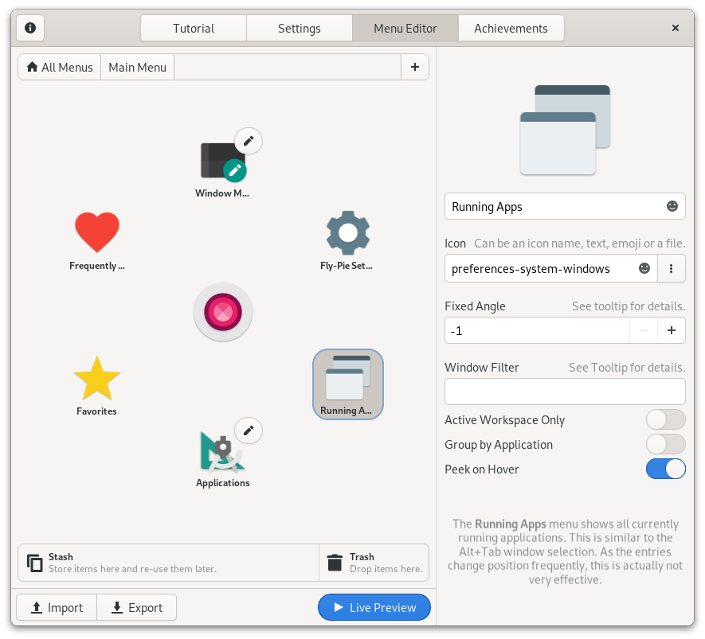

<p align="center"> 
  
</p>

[](https://github.com/Schneegans/Fly-Pie/actions)
[](metadata.json)
[](LICENSE)
[](cloc.sh)
[](cloc.sh)
[](https://extensions.gnome.org/extension/3433/fly-pie)

**Fly-Pie** is an attractive marking menu for Gnome Shell which can be used to launch applications, simulate hotkeys, open URLs and much more.
It features a continuous learning curve which lets you gradually lift-off from a grumpie menu rookie to a snappie menu pielot.
(You got it? Like pilot, but with a :cake:).

# About Fly-Pie

<a href="https://youtu.be/U22VxoT-tNU"></a>

Fly-Pie is designed for people who have **one hand at the mouse** most of the time.
It is **not** designed to be used with a keyboard only; there are other applications which work better in this case (for example [kupfer](https://github.com/kupferlauncher/kupfer)).
Fly-Pie will also play nicely with **touch input**. 
While it might work already, a future version of Fly-Pie will be dedicated to add proper touch support.

Click the player image on the right to watch a trailer on YouTube!

## Features

_:construction: **Under Construction:** Fly-Pie is still under heavy development! Whenever you encounter a :beetle: bug or have :tada: feature request, 
report this via [Github issues](https://github.com/schneegans/fly-pie/issues)._

The list below provides both, a high-level overview of Fly-Pie's current capabilities as well as a rough idea of planned features. Check out the [changelog](docs/changelog.md) as well!

- [X] Create as many menus as you want.
- [X] Bind menus to shortcuts.
- [X] Create as deep menu hierarchies as you want.
- [X] Two selection modes which can be used together:
  - [X] **Point-and-Click:** Select items by clicking anywhere in the corresponding wedge.
  - [X] **Marking-Mode:** Select items by drawing gestures.
- [X] **Live Preview:** See your configuration changes instantaneously.
- [X] Available Menu Types:
  - [X] **Custom Menu:** Fill this with actions or submenus!
  - [X] **Bookmarks:** Shows your commonly used directories.
  - [X] **Devices:** Shows connected devices.
  - [X] **Running Apps:** Shows the currently running applications.
  - [X] **Recent Files:** Shows your recently used files.
  - [X] **Frequently Used:** Shows your frequently used applications.
  - [X] **Favorites:** Shows your pinned applications.
  - [X] **Main Menu:** Shows all installed applications (This requires GMenu typelib to be installed. `sudo apt-get install gir1.2-gmenu-3.0` on Ubuntu).
- [X] Available Actions Types:
  - [X] **Run Command:** Executes any given shell command.
  - [X] **Activate Shortcut:** Simulates a key stroke.
  - [X] **Insert Text:** Pastes some given text to wherever the cursor currently is.
  - [X] **Open URI:** Opens an URI with the default applications.
  - [X] **Open File:** Opens a file with the default applications.
  - [X] **D-Bus Signal:** Emits a signal on the D-Bus.
- [X] D-Bus Interface:
  - [X] Open pre-configured menus via the D-Bus.
  - [X] Open custom menus via the D-Bus.
- [X] Available on [extensions.gnome.org](https://extensions.gnome.org/extension/3433/fly-pie).
- [X] Translation Support:
  - [X] English
  - [X] German
  - [X] Italian
  - [ ] ...
- [ ] Proper touch support.
- [ ] Cool appearance presets.
- [ ] Achievements!

# Installation

You can either install Fly-Pie from extensions.gnome.org (a), download a stable release from GitHub (b) or clone the latest version directly with `git` (c).

## a) Installing from extensions.gnome.org

This is the most easy way to install Fly-Pie. Just head over to [extensions.gnome.org](https://extensions.gnome.org/extension/3433/fly-pie) and flip the switch! If you want to use a more up-to-date version of Fly-Pie, you can try one of the methods listed below.

## b) Downloading a Stable Release

Execute this command to download the latest stable release:

```bash
wget https://github.com/Schneegans/Fly-Pie/releases/latest/download/flypie@schneegans.github.com.zip
```

Install it by executing the following command. If you have Fly-Pie already installed and want to upgrade to
the latest version, append the `--force` flag in order to overwrite existing installs of Fly-Pie.

```bash
gnome-extensions install flypie@schneegans.github.com.zip
```

Then restart Gnome Shell with <kbd>Alt</kbd> + <kbd>F2</kbd>, <kbd>r</kbd> + <kbd>Enter</kbd>.
Or logout / login if you are on Wayland.
Then you can enable the extension with the *Gnome Tweak Tool*, the *Extensions* application or with this command:

```bash
gnome-extensions enable flypie@schneegans.github.com
```


## c) Cloning the Latest Version with `git`

```bash
cd ~/.local/share/gnome-shell/extensions
git clone https://github.com/Schneegans/Fly-Pie.git
mv Fly-Pie flypie@schneegans.github.com
```

You will have to compile the translations if you want to use Fly-Pie in your own language:

```bash
flypie@schneegans.github.com/compile-locales.sh
```

Then restart Gnome Shell with <kbd>Alt</kbd> + <kbd>F2</kbd>, <kbd>r</kbd> + <kbd>Enter</kbd>.
Or logout / login if you are on Wayland.
Then you can enable the extension with the *Gnome Tweak Tool*, the *Extensions* application or with this command:

```bash
gnome-extensions enable flypie@schneegans.github.com
```

# First Steps with Fly-Pie

If you installed and enabled Fly-Pie for the very first time, you can bring up the default menu with <kbd>Ctrl</kbd> + <kbd>Space</kbd>. If nothing happens, you can execute the following command in a terminal, try again to open the menu and look for any errors. This may print many unrelated messages, but using `grep` like this highlights all occurrences of `flypie` which makes spotting Fly-Pie-related messages much easier.

```bash
journalctl -f -o cat | grep -E 'flypie|'
```

When you open the settings dialog of Fly-Pie, you will be greeted with an interactive tutorial demonstrating effective usage patterns.
Here is a summary of the major hints to ease your path to become a master pielot:
* You can **click anywhere in an item's wedge**. It does not matter whether you click directly on an item or at the edge of your screen as long as you are in the same wedge.
* To enter **Marking Mode**, click and drag an item. As soon as you pause dragging or make a turn, the item will be selected. **This way you can select items with gestures!**
* Try remembering the path to an item. Open the menu and **draw the path with your mouse**. You can start with individual segments of the path, put you can also try to draw the entire path!
* You may find it more successful if you explicitly try to compose your gesture of straight parts. **Do not draw curvy paths but rather expressive zig-zag-lines!**


## Bake Your First Pie Menu!



The default menu may give you the opportunity to play around with Fly-Pie, but you should definitely define your own menus!

The configuration dialog of Fly-Pie has three pages. On the first page you can define its **appearance**, on the second you can **define your own menus**. The last one... well, we will come to this later!

With the play-button you can always open a **live-preview** of your menu.
Just play around with the options, most of it should be more or less self-explanatory.

## Tweak the Appearance Settings!

While there are not many presets included for now - this will happen in a future version - you can already create your own! There are quite some possibilities...


## Alternative Ways to Open Menus

There are two possibilities to open menus. Either via the configured shortcut or with a terminal command as described below. This second approach can be used in combination with other tools. Interesting companions are:
* [CustomCorner](https://extensions.gnome.org/extension/1037/customcorner/): Open menus by moving your mouse to one corner of your screen!
* [Easystroke](https://github.com/thjaeger/easystroke/wiki): X11 only, use mouse gestures to open menus!
* [xbindkeys](http://www.nongnu.org/xbindkeys/xbindkeys.html): X11 only, bind menus to your additional mouse buttons!


# Fly-Pie's D-Bus Interface

Fly-Pie has a D-Bus interface which allows not only to open configured menus via the command line, but also to open completely custom-made menus defined with a JSON string.

To see all available methods and signals you can introspect the interface:

```bash
gdbus introspect --session --dest org.gnome.Shell \
                 --object-path /org/gnome/shell/extensions/flypie
```

## Opening Menus Configured with the Menu Editor

Use the following command to open a menu you configured with the Fly-Pie's Menu Editor.
You just have to replace the only parameter `My Menu` with the name of your desired menu!

```bash
gdbus call --session --dest org.gnome.Shell --object-path /org/gnome/shell/extensions/flypie \
           --method org.gnome.Shell.Extensions.flypie.ShowMenu 'My Menu'
```

There is also a similar method called `PreviewMenu` which will open the given menu in preview mode.

```bash
gdbus call --session --dest org.gnome.Shell --object-path /org/gnome/shell/extensions/flypie \
           --method org.gnome.Shell.Extensions.flypie.PreviewMenu 'My Menu'
```

## Opening Custom Menus via JSON

You can pass a JSON menu configuration to the `ShowCustomMenu` to show a custom menu.
Here is an example showing a menu with two elements.
Selecting them will change your workspace up or down (by simulating a <kbd>Ctrl</kbd>+<kbd>Alt</kbd>+<kbd>Up</kbd> or a <kbd>Ctrl</kbd>+<kbd>Alt</kbd>+<kbd>Down</kbd> respectively).
Further below you will find a complete description of this JSON menu configuration format.

```bash
gdbus call --session --dest org.gnome.Shell                 \
  --object-path /org/gnome/shell/extensions/flypie          \
  --method org.gnome.Shell.Extensions.flypie.ShowCustomMenu \
  '{                                                        \
    "icon": "💠️",                                           \
    "children": [                                           \
      {                                                     \
        "name": "Up",                                       \
        "icon": "🔼️",                                       \
        "type": "Shortcut",                                 \
        "data": "<Primary><Alt>Up"                          \
      },                                                    \
      {                                                     \
        "name": "Down",                                     \
        "icon": "🔽️",                                       \
        "type": "Shortcut",                                 \
        "data": "<Primary><Alt>Down"                        \
      }                                                     \
    ]                                                       \
  }'
```

### The Menu Configuration Format 

**:information_source: _Pro-Tip:_** _You can export your menu configuration from the menu editor of Fly-Pie's settings dialog. The exported JSON file contains an array of menu configurations which follow the specification below. This way you can use the menu editor to design a menu which you want to open dynamically over the D-Bus!_

Each item in the menu hierarchy can have the following properties.
All of them are optional, the default values are noted in the description,
Some of them are only available for top-level menu items; this is noted in the table as well.

| Parameters | Value Type | Description |
|------------|------------|-------------|
| **`name`** | A string.  |  This will be shown in the center when the item is hovered. If omitted, it will be set based on the given `type`. |
| **`icon`** | An absolute image file path, an icon name or arbitrary text. | Icon names like `firefox` are commonly used. As text is an option too, you can use emoji like 🚀 for the icons! If omitted, it will be set based on the given `type`. |
| **`type`** | A string from the table below. | Some types require setting the additional `data` property. For items with children this defaults to `"CustomMenu"`, for leaf items this defaults to `"DBusSignal"`. |
| **`data`** | Additional data required for the `type`. | See the table below for details. The default value depends on the given `type`. |
| **`angle`** | A number from 0 - 359. | This forces the item to be placed in a specific direction. However, there is a restriction on the fixed angles. Inside a menu level, the fixed angles must be monotonically increasing, that is each fixed angle must be larger than any previous fixed angle. |
| **`centered`** | A boolean only for top-level items. | When set to `true`, the menu will be shown in the middle of the screen, else it will be shown at the mouse pointer. If omitted, this defaults to _`false`_. |
| **`children`** | An array of child items. | This can only be set for the `"type": "CustomMenu"`. No `data` is required. |

The table below lists all possible item types. Some of the types require that the `data` property is set to some value.

| Actions | Default `data`  | Description |
|------------|-----------------------|-------------|
| **`"Command"`** | `""` | This action executes a command given in `data`. This is primarily used to open applications but may have plenty of other use cases as well. |
| **`"DBusSignal"`** | `""` | This action does nothing on its own. But you can listen on the D-Bus for its activation. This can be very useful in custom menus opened via the command line. The string given in `data` will be passed as `itemID` to the `OnSelect` signal. Below this table you will find an example! |
| **`"File"`** | `""` | This action will open a file given with an absolute path in `data` with your system\'s default application. |
| **`"InsertText"`** | `""` | This action copies the text given in `data` to the clipboard and then simulates a Ctrl+V. This can be useful if you realize that you often write the same things. |
| **`"Shortcut"`** | `""` | This action simulates a key combination when activated. For example, this can be used to switch virtual desktops, control multimedia playback or to undo / redo operations. `data` should be something like `"<Primary>space"`. |
| **`"Uri"`** | `""` | When this action is activated, the URI given in `data` is opened with the default application. For http URLs, this will be your web browser. However, it is also possible to open other URIs such as `"mailto:foo@bar.org"`. |
| **Menus** | | |
| **`"CustomMenu"`** | _not used_ | Use the `"children"` property to add as many actions or submenus as you want! |
| **`"Bookmarks"`** | _not used_ | This menu shows an item for the trash, your desktop and each bookmarked directory. |
| **`"Devices"`** | _not used_ | This menu shows an item for each mounted volume, like USB-Sticks. |
| **`"Favorites"`** | _not used_ | This menu shows the applications you have pinned to Gnome Shell's Dash. |
| **`"FrequentlyUsed"`** | `"7"` | This menu shows a list of frequently used applications. You should limit the maximum number of shown applications to a reasonable number given in `data`. |
| **`"MainMenu"`** | _not used_ | This menu shows all installed applications. Usually, this is very cluttered as many sections contain too many items to be used efficiently. You should rather setup your own menus! This menu is only available if the typelib for GMenu is installed on the system. Usually the package is called something like `gir1.2-gmenu-3.0`. |
| **`"RecentFiles"`** | `"7"` | This menu shows a list of recently used files. You should limit the maximum number of shown files to a reasonable number given in `data`. |
| **`"RunningApps"`** | _not used_ | This menu shows all currently running applications. This is similar to the Alt+Tab window selection. As the entries change position frequently, this is actually not very effective. |
| **`"System"`** | _not used_ | This menu shows an items for screen-lock, shutdown, settings, etc. |

### Return Value

The `ShowMenu` methods will return an integer.
This will be either negative (Fly-Pie failed to parse the provided description, see [DBusInterface.js](common/DBusInterface.js) for a list of error codes) or a positive menu ID which will be passed to the signals of the interface.

If an error occurred, there is a good chance that Fly-Pie logged an error message. To see them use this command in another terminal:

```bash
journalctl -f -o cat | grep -E 'flypie|'
```

### The `"DBusSignal"` Action

If you want to make menu items perform actions which are not available in Fly-Pie, you can use the `"DBusSignal"` item type and wait for their selection on the D-Bus.

There are two signals; `OnCancel` will be fired when the user aborts the selection in a menu, `OnSelect` is activated when the user makes a selection.
Both signals send the _menu ID_ which has been reported by the corresponding `ShowMenu` call, in addition, `OnSelect` sends the _item ID_ of the selected item.

The _item ID_ will usually be a path in the form of `"/1/0"`.
This example would mean that the first child of the second child of the root menu was selected (indices are zero-based).
In the simple menu example below, selecting `Apatosaurus` will yield `"/1/0"`.
If you assigned a `data` property to some of your `"type": "DBusSignal"` items, this will be returned instead of the path (like the `cat!!` in the example below).

**:information_source: _Hint:_** _Note that no `"type"` is given in the example because `"CustomMenu"` is the default value if an item contains children and `"DBusSignal"` is the default value for leaf items._

```bash
gdbus call --session --dest org.gnome.Shell                 \
  --object-path /org/gnome/shell/extensions/flypie          \
  --method org.gnome.Shell.Extensions.flypie.ShowCustomMenu \
  '{                                                        \
    "icon": "😷️",                                           \
    "children": [                                           \
      {                                                     \
        "name": "Rocket",                                   \
        "icon":"🚀"                                         \
      },                                                    \
      {                                                     \
        "name": "Doughnut",                                 \
        "icon":"🍩",                                        \
        "children": [                                       \
          {                                                 \
            "name": "Apatosaurus",                          \
            "icon":"🦕"                                     \
          },                                                \
          {                                                 \
            "name": "Cat",                                  \
            "icon":"🐈",                                    \
            "data": "cat!!"                                 \
          }                                                 \
        ]                                                   \
      }                                                     \
  ]}'
```

You can use the following command to monitor the emitted signals:

```bash
gdbus monitor --session --dest org.gnome.Shell \
              --object-path /org/gnome/shell/extensions/flypie
```


# Contributing to Fly-Pie

Whenever you encounter a :beetle: **bug** or have a :tada: **feature request**, 
report this via [Github issues](https://github.com/schneegans/fly-pie/issues).

We are happy to receive contributions to Fly-Pie in the form of **pull requests** via Github.
Feel free to fork the repository, implement your changes and create a merge request to the `develop` branch.

For detailed contribution guidelines, see [CONTRIBUTING.md](docs/CONTRIBUTING.md).

Developing a Gnome Shell extension is not easy, as debugging possibilities are quite limited. One thing you should always do is to monitor Gnome Shells output for error or debug messages produced by Fly-Pie. This can be done with the command below. This may print many unrelated messages, but using `grep` like this highlights all occurrences of `flypie` which makes spotting Fly-Pie-related messages much easier.

```bash
journalctl -f -o cat | grep -E 'flypie|'
```

## Translating Fly-Pie

A great way to contribute to Fly-Pie is creating a translation to another language!
We suggest using a tool like [Poedit](https://poedit.net/) or the [GNOME Translation Editor](https://wiki.gnome.org/Apps/Gtranslator).

Translations of Fly-Pie are stored in the `po/` directory.
Just edit an existing translation or create a new one by opening the template [`po/flypie.pot`](po/flypie.pot) with either of these tools.

Once you are happy with your translation, save a `<country code>.po` file in the `/po` directory and run the following command to compile the strings:

```bash
./compile-locales.sh
```

In order for this to work, you'll need to install the `gettext` package. In Ubuntu 20.04 and 20.10, it can be installed by running the following command:

```bash
sudo apt install gettext
```

Then restart Gnome Shell with <kbd>Alt</kbd> + <kbd>F2</kbd>, <kbd>r</kbd> + <kbd>Enter</kbd>.
Or logout / login if you are on Wayland.

You can add your new `*.po` file with a commit like `:globe_with_meridians: Add new translation for <country code>` and submit a pull request!
**To get started, have a look at the [Pull Request Template](.github/PULL_REQUEST_TEMPLATE/add_or_update_translation.md)**.
When you create your pull request, you can simply append a `&template=add_or_update_translation.md` to the URL of your pull request to auto-populate the body of your pull request with the template.

Please refer to [CONTRIBUTING.md](docs/CONTRIBUTING.md) for the some further contribution guidelines.
