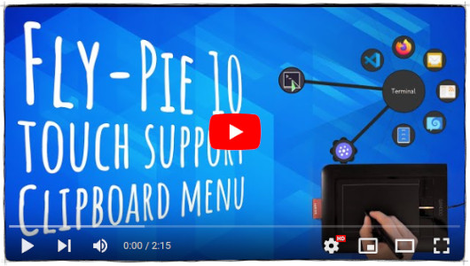

  

  
   
  
  
  
  
  

**Fly-Pie** is an extension for GNOME Shell which lets you open _marking menus_ via keyboard shortcuts. _And — to the best of my knowledge — it is the <a href="https://www.youtube.com/watch?v=Lj-uefp36Jk">first GNOME Shell extension with achievements</a>!_ :trophy:

You can use it to launch applications, simulate hotkeys, open URLs and much more.
It features a continuous learning curve which lets you gradually lift-off from a grumpie menu rookie to a snappie menu pielot.
(You got it? Like pilot, but with a :cake:).
Once you opened a marking menu, you can seamlessly transition between three alternative selection modes:

* **Point-and-Click:** Select items by clicking on them or anywhere in the corresponding wedges.
* **Marking-Mode:** Select items by drawing gestures. To do this, click anywhere and drag your mouse. Pausing or making a turn selects the currently dragged item.
* **Turbo-Mode:** You can also "draw" gestures while holding <kbd>Ctrl</kbd>, <kbd>Shift</kbd>, or <kbd>Alt</kbd> _without having to press your mouse button_! This is especially useful when you opened the menu with a shortcut involving such a modifier.

Do you want to learn more? Have a look at the [usage guide](docs/first-steps.md)!

# :heart: Will you love Fly-Pie?

  

Fly-Pie is designed for you **if you have one hand at the mouse** most of the time.
It is _not_ designed to be used with a keyboard only; there are other
applications which work better in this case (for example [kupfer](https://github.com/kupferlauncher/kupfer)).
Fly-Pie also works nicely with **touch input**.

If you want to learn more, use the links below for much more information!

## Getting Started

* [Installation](docs/installation.md)
* [First Steps](docs/first-steps.md)
* [The D-Bus Interface](docs/dbus-interface.md)

## Contributing to Fly-Pie

* [Contributing Guidelines](docs/contributing.md)
* [Software Architecture](docs/software-architecture.md)
* [Translating Fly-Pie](docs/translating.md)
* [Creating New Action Types](docs/creating-actions.md)
* [Creating New Menu Types](docs/creating-menus.md)

## Additional Information

* [Changelog](docs/changelog.md)
* [Release Management](docs/release-management.md)
* [Continuous Integration](docs/continuous-integration.md)

# :revolving_hearts: These people _do_ love Fly-Pie

While coding new features or translating Fly-Pie is the most awesome way to contribute, providing financial support will help me stay motivated to invest my spare time to keep the project alive in the future.

<h2 align="center">🥇 Current Gold Sponsors</h2>

    <a href="https://github.com/dennis1248">Dennis ten Hoove</a> 

<h2 align="center">🥈 Current Silver Sponsors</h2>

  <a href="https://twitter.com/tjiiik">tj3k</a> 
  <a href="https://www.llorachdevs.com/Home">Garsiv</a> 
  <a href="https://github.com/SimHacker">@SimHacker</a> 
  <a href="https://github.com/castrojo">Jorge Castro</a>

<h2 align="center">🥉 Current Bronze Sponsors</h2>

  <a href="https://github.com/lobau">@lobau</a> 
  <a href="https://github.com/FahriDevZ">@FahriDevZ</a>

<h2 align="center">🏅 Previous Sponsors and One-Time Donators</h2>

  <a href="https://github.com/VinnyBoiler">@VinnyBoiler</a> 
  <a href="https://github.com/p2004a">@p2004a</a> 
  <a href="https://github.com/BakiDance">@BakiDance</a> 
  GEPLlinux 
  <a href="https://github.com/denis-roy">@denis-roy</a> 
  <a href="https://github.com/ykhurshid">@ykhurshid</a>

Do you want to show that you love it too? You may <a href="https://github.com/sponsors/Schneegans">become a sponsor for as little as 1$ / month</a>!
If you like this extension, you may also want to try one of my other extensions: [🧊 Desktop-Cube](https://github.com/Schneegans/Desktop-Cube) or [🔥 Burn-My-Windows](https://github.com/Schneegans/Burn-My-Windows/)!

