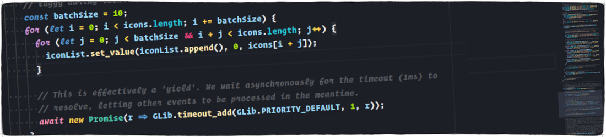

<p align="center">
  
</p>

# Creating New Menu Types for Fly-Pie

There are two fundamental item types in Fly-Pie: _Actions_ and _Menus_.
Actions have an `onSelect()` method which is called when the user selects them; Menus can have child Actions or child Menus. 

If you want to create a new Menu type for Fly-Pie, this guide is made for you!
As an example, we will create a Menu which contains three actions, each of which shows a desktop notification when selected.

First, create a file `src/common/menus/ExampleMenu.js` with the following content.
You should read the code, most of it is explained with inline comments!

```javascript
//////////////////////////////////////////////////////////////////////////////////////////
//        ___            _     ___                                                      //
//        |   |   \/    | ) |  |           This software may be modified and distri-    //
//    O-  |-  |   |  -  |   |  |-  -O      buted under the terms of the MIT license.    //
//        |   |_  |     |   |  |_          See the LICENSE file for details.            //
//                                                                                      //
//////////////////////////////////////////////////////////////////////////////////////////

'use strict';

// This is required for localization support.
const _ = imports.gettext.domain('flypie').gettext;

// We have to import the Main module optionally. This is because this file is included
// from both sides: From prefs.js and from extension.js. When included from prefs.js, the
// Main module is not available. This is not a problem, as the preferences will not call
// the createItem() methods below; they are merely interested in the menu's name, icon
// and description.
let Main = undefined;

try {
  Main = imports.ui.main;
} catch (error) {
  // Nothing to be done, we're in settings-mode.
}

// Some extension-local imports we will use further down.
const Me           = imports.misc.extensionUtils.getCurrentExtension();
const utils        = Me.imports.src.common.utils;
const ItemRegistry = Me.imports.src.common.ItemRegistry;

//////////////////////////////////////////////////////////////////////////////////////////
// This simple example menu contains three actions, each of which shows a desktop       //
// notification when selected.                                                          //
//////////////////////////////////////////////////////////////////////////////////////////

// This should be always named 'menu'.
var menu = {

  // There are two fundamental item types in Fly-Pie: Actions and Menus. Actions have an
  // onSelect() method which is called when the user selects the item, Menus can have
  // child Actions or Menus. In this example we create a Menu!
  class: ItemRegistry.ItemClass.MENU,

  // This will be shown in the add-new-item-popover of the settings dialog.
  // It should be translatable.
  name: _('ExampleMenu'),

  // This is also used in the add-new-item-popover.
  icon: 'accessories-clipboard',

  // Translators: Please keep this short.
  // This is the (short) description shown in the add-new-item-popover.
  subtitle: _('Foo.'),

  // This is the (long) description shown when an item of this type is selected.
  description: _('Bar bar bar bar.'),

  // Menus can also have a data field. See the documentation on how-to create custom
  // actions for details. This example menu does not use a data field.
  // data: { ... }

  // This will be called whenever a menu is opened containing an item of this kind.
  createItem: () => {
    // This will be printed to the log when a menu is opened containing such an item.
    utils.debug('ExampleMenu Created!');

    // This method should return an object containing a 'children' array. Each array
    // element has to have a 'name' and an 'icon'. The onSelect() function will be
    // called when the user selects the corresponding item.
    return {
      children: [
        {
          name: _('First Item'),
          icon: '♈',
          onSelect: () => {
            Main.notify(_('♈ Selected!'), _('This is the first item!'));
          }
        },
        {
          name: _('Second Item'),
          icon: '♎',
          onSelect: () => {
            Main.notify(_('♎ Selected!'), _('This is the second item!'));
          }
        },
        {
          name: _('Third Item'),
          icon: '♐',
          onSelect: () => {
            Main.notify(_('♐ Selected!'), _('This is the third item!'));
          }
        }
      ]
    };
  }
};
```

Once this file is in place, you just need to add the new Action to the `src/common/ItemRegistry.js`.
To do this, add the following line to the other, similar-looking lines in `getItemTypes()`.

```javascript
ExampleMenu: actions.ExampleMenu.menu,
```

Finally you can restart GNOME Shell with <kbd>Alt</kbd> + <kbd>F2</kbd>, <kbd>r</kbd> + <kbd>Enter</kbd> (or logout / login on Wayland).
If you now open Fly-Pie's Menu Editor, you can add your new Menu!
It will not have any configuration options, as we decided not to add the `data` property above.
You can have a look at the [`RecentFiles.js`](../src/common/menus/RecentFiles.js) menus for an example using a data property.

That's it.
Now you can start modifying the code!

<p align="center"></p>

<p align="center">
  <a href="creating-actions.md"> Creating New Action Types</a>
  
  <a href="../README.md#getting-started"> Index</a>
  
  <a href="changelog.md">Changelog </a>
  
</p>
