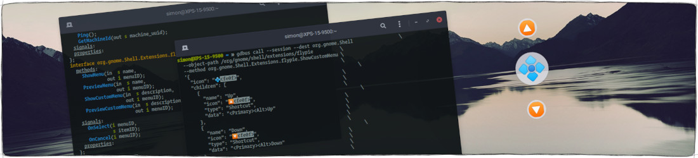

<p align="center">
  
</p>

# Fly-Pie's D-Bus Interface

Fly-Pie has a D-Bus interface which allows not only to open configured menus via the command line,
but also to open completely custom-made menus defined with a JSON string.

To see all available methods and signals you can introspect the interface:

```bash
gdbus introspect --session --dest org.gnome.Shell \
                 --object-path /org/gnome/shell/extensions/flypie
```

## Opening Menus Configured with the Menu Editor

Use the following command to open a menu you configured with the Fly-Pie's Menu Editor.
You just have to replace the only parameter `Main Menu` with the name of your desired menu!

```bash
gdbus call --session --dest org.gnome.Shell --object-path /org/gnome/shell/extensions/flypie \
           --method org.gnome.Shell.Extensions.flypie.ShowMenu 'Main Menu'
```

There is also a similar method called `ShowMenuAt` which will open the given menu at the specified pixel location.

```bash
gdbus call --session --dest org.gnome.Shell --object-path /org/gnome/shell/extensions/flypie \
           --method org.gnome.Shell.Extensions.flypie.ShowMenuAt 'Main Menu' 234 456
```
Lastly, there is a method called `PreviewMenu` which will open the given menu in preview mode.

```bash
gdbus call --session --dest org.gnome.Shell --object-path /org/gnome/shell/extensions/flypie \
           --method org.gnome.Shell.Extensions.flypie.PreviewMenu 'Main Menu'
```

## Opening Custom Menus via JSON

You can pass a JSON menu configuration to the `ShowCustomMenu` (and `ShowCustomMenuAt`, `PreviewCustomMenu`) to show a custom menu.
Here is an example showing a menu with two elements.
Selecting them will change your workspace up or down (by simulating a <kbd>Ctrl</kbd>+<kbd>Alt</kbd>+<kbd>Up</kbd>
or a <kbd>Ctrl</kbd>+<kbd>Alt</kbd>+<kbd>Down</kbd> respectively).
Further below you will find a complete description of this JSON menu configuration format.

```bash
gdbus call --session --dest org.gnome.Shell                 \
  --object-path /org/gnome/shell/extensions/flypie          \
  --method org.gnome.Shell.Extensions.flypie.ShowCustomMenu \
  '{                                                        \
    "icon": "💠️",                                           \
    "children": [                                           \
      {                                                     \
        "name": "Up",                                       \
        "icon": "🔼️",                                       \
        "type": "Shortcut",                                 \
        "data": {                                           \
          "shortcut": "<Primary><Alt>Up"                    \
        }                                                   \
      },                                                    \
      {                                                     \
        "name": "Down",                                     \
        "icon": "🔽️",                                       \
        "type": "Shortcut",                                 \
        "data": {                                           \
          "shortcut": "<Primary><Alt>Down"                  \
        }                                                   \
      }                                                     \
    ]                                                       \
  }'
```

### The Menu Configuration Format

**:information_source: _Pro-Tip:_** _You can export your menu configuration from the menu editor of Fly-Pie's settings dialog.
The exported JSON file contains an array of menu configurations which follow the specification below.
This way you can use the menu editor to design a menu which you want to open dynamically over the D-Bus!_

Each item in the menu hierarchy can have the following properties.
All of them are optional, the default values are noted in the description,
Some of them are only available for top-level menu items; this is noted in the table as well.

| Parameters | Value Type | Description |
|------------|------------|-------------|
| **`name`** | A string.  |  This will be shown in the center when the item is hovered. If omitted, it will be set based on the given `type`. |
| **`icon`** | An absolute image file path, an icon name or arbitrary text. | Icon names like `firefox` are commonly used. As text is an option too, you can use emoji like 🚀 for the icons! If omitted, it will be set based on the given `type`. |
| **`type`** | A string from the table below. | Some types require setting the additional `data` property. For items with children this defaults to `"CustomMenu"`, for leaf items this defaults to `"DBusSignal"`. |
| **`data`** | Additional data required for the `type`. | See the table below for details. The default value depends on the given `type`. |
| **`angle`** | A number from 0 - 359. | This forces the item to be placed in a specific direction. However, there is a restriction on the fixed angles. Inside a menu level, the fixed angles must be monotonically increasing, that is each fixed angle must be larger than any previous fixed angle. |
| **`centered`** | A boolean only for top-level items. | When set to `true`, the menu will be shown in the middle of the screen, else it will be shown at the mouse pointer. If omitted, this defaults to _`false`_. |
| **`children`** | An array of child items. | This can only be set for the `"type": "CustomMenu"`. No `data` is required. |

The table below lists all possible item types. Some of the types require that the `data` property is set to some value.

| Actions | Default `data`  | Description |
|------------|-----------------------|-------------|
| **`"Command"`** | `{"command":""}` | This action executes a command given in `data`. This is primarily used to open applications but may have plenty of other use cases as well. |
| **`"DBusSignal"`** | `{"id":""}` | This action does nothing on its own. But you can listen on the D-Bus for its activation. This can be very useful in custom menus opened via the command line. The ID string given in `data` will be passed as `itemID` to the `OnHover`, `OnUnhover` and `OnSelect` signals. Below this table you will find an example! |
| **`"File"`** | `{"file":""}` | This action will open a file given with an absolute path in `data` with your system\'s default application. |
| **`"InsertText"`** | `{"text":""}` | This action copies the text given in `data` to the clipboard and then simulates a Ctrl+V. This can be useful if you realize that you often write the same things. |
| **`"Shortcut"`** | `{"shortcut":""}` | This action simulates a key combination when activated. For example, this can be used to switch virtual desktops, control multimedia playback or to undo / redo operations. `data` should be something like `{"shortcut":"<Primary>space"}`. |
| **`"Uri"`** | `{"uri":""}` | When this action is activated, the URI given in `data` is opened with the default application. For http URLs, this will be your web browser. However, it is also possible to open other URIs such as `{"uri":"mailto:foo@bar.org"}`. |
| **Menus** | | |
| **`"CustomMenu"`** | _not used_ | Use the `"children"` property to add as many actions or submenus as you want! |
| **`"Bookmarks"`** | _not used_ | This menu shows an item for the trash, your desktop and each bookmarked directory. |
| **`"Clipboard"`** | `{"maxNum":7, "startAngle":-1}` | This menu shows items for the most recently copied items. |
| **`"Devices"`** | _not used_ | This menu shows an item for each mounted volume, like USB-Sticks. |
| **`"Favorites"`** | _not used_ | This menu shows the applications you have pinned to GNOME Shell's Dash. |
| **`"FrequentlyUsed"`** | `{"maxNum":7}` | This menu shows a list of frequently used applications. You should limit the maximum number of shown applications to a reasonable number given in `data`. |
| **`"MainMenu"`** | _not used_ | This menu shows all installed applications. Usually, this is very cluttered as many sections contain too many items to be used efficiently. You should rather setup your own menus! This menu is only available if the typelib for GMenu is installed on the system. Usually the package is called something like `gir1.2-gmenu-3.0`. |
| **`"RecentFiles"`** | `{"maxNum":7}` | This menu shows a list of recently used files. You should limit the maximum number of shown files to a reasonable number given in `data`. |
| **`"RunningApps"`** | `{"activeWorkspaceOnly": false, "appGrouping": true, "hoverPeeking": true, "nameRegex": ''}` | This menu shows all currently running applications. This is similar to the Alt+Tab window selection. As the entries change position frequently, this is actually not very effective. |
| **`"System"`** | _not used_ | This menu shows an items for screen-lock, shutdown, settings, etc. |

### Return Value

The `ShowMenu` methods will return an integer.
This will be either negative (Fly-Pie failed to parse the provided description, see [DBusInterface.js](../src/common/DBusInterface.js)
for a list of error codes) or a positive menu ID which will be passed to the signals of the interface.

If an error occurred, there is a good chance that Fly-Pie logged an error message. To see them use this command in another terminal:

```bash
journalctl -f -o cat | grep -E 'flypie|'
```

### The `"DBusSignal"` Action

If you want to make menu items perform actions which are not available in Fly-Pie,
you can use the `"DBusSignal"` item type and wait for their selection on the D-Bus.

There are four signals; `OnCancel` will be fired when the user aborts the selection in a menu,
`OnSelect` is activated when the user makes a selection
and `OnHover` and `OnUnhover` are called whenever an action begins or stops being hovered in point-and-click mode or dragged around in marking mode.
All signals send the _menu ID_ which has been reported by the corresponding `ShowMenu` call,
in addition, `OnSelect`, `OnHover`, and `OnUnhover` send the _item ID_ of the selected item.

The _item ID_ will usually be a path in the form of `"/1/0"`.
This example would mean that the first child of the second child of the root menu was selected (indices are zero-based).
In the simple menu example below, selecting `Apatosaurus` will yield `"/1/0"`.
If you assigned a `data` property to some of your `"type": "DBusSignal"` items,
this will be returned instead of the path (like the `cat!!` in the example below).

**:information_source: _Hint:_** _Note that no `"type"` is given in the example because
`"CustomMenu"` is the default value if an item contains children and `"DBusSignal"` is the default value for leaf items._

```bash
gdbus call --session --dest org.gnome.Shell                 \
  --object-path /org/gnome/shell/extensions/flypie          \
  --method org.gnome.Shell.Extensions.flypie.ShowCustomMenu \
  '{                                                        \
    "icon": "😷️",                                           \
    "children": [                                           \
      {                                                     \
        "name": "Rocket",                                   \
        "icon":"🚀"                                         \
      },                                                    \
      {                                                     \
        "name": "Doughnut",                                 \
        "icon":"🍩",                                        \
        "children": [                                       \
          {                                                 \
            "name": "Apatosaurus",                          \
            "icon":"🦕"                                     \
          },                                                \
          {                                                 \
            "name": "Cat",                                  \
            "icon":"🐈",                                    \
            "data": {"id": "cat!!"}                         \
          }                                                 \
        ]                                                   \
      }                                                     \
  ]}'
```

You can use the following command to monitor the emitted signals:

```bash
gdbus monitor --session --dest org.gnome.Shell \
              --object-path /org/gnome/shell/extensions/flypie
```

## Selecting Items via D-Bus

There is also a `SelectItem` method exposed, which you can use to select an item in a currently opened menu.
As a parameter, this method expects a /-delimited path to the menu item where each element of the path is the to-be-selected item's index.
For instance, you can open a menu in preview mode like this:

```bash
gdbus call --session --dest org.gnome.Shell --object-path /org/gnome/shell/extensions/flypie \
           --method org.gnome.Shell.Extensions.flypie.PreviewMenu 'Main Menu'
```

Once this is visible, you can select the first item (usually at the top) with the following command:

```bash
gdbus call --session --dest org.gnome.Shell --object-path /org/gnome/shell/extensions/flypie \
           --method org.gnome.Shell.Extensions.flypie.SelectItem '/0'
```

The path `/` selects the root item, `/0/1` would select the second child of the first child of the root item.


## Preselecting Items via D-Bus

You can use the `SelectItem` right after a menu is shown to preselect this item.
The following command will open the top item of the `"Main Menu"` selected and centered at the pointer.
This will only work if your `"Main Menu"` has custom menu at the top position!
Else it will be executed right away...

```bash
gdbus call --session --dest org.gnome.Shell --object-path /org/gnome/shell/extensions/flypie \
           --method org.gnome.Shell.Extensions.flypie.ShowMenu 'Main Menu' &&                \
gdbus call --session --dest org.gnome.Shell --object-path /org/gnome/shell/extensions/flypie \
           --method org.gnome.Shell.Extensions.flypie.SelectItem '/0'
```

## Closing a Menu

There is also a method for closing the currently active menu.
It will return a negative integer if some goes wrong.

```bash
gdbus call --session --dest org.gnome.Shell --object-path /org/gnome/shell/extensions/flypie \
           --method org.gnome.Shell.Extensions.flypie.CancelMenu
```

<p align="center"></p>

<p align="center">
  
  <a href="first-steps.md"> First Steps</a>
  
  <a href="../README.md#getting-started"> Index</a>
  
  <a href="contributing.md">Contributing Guidelines </a>
</p>
