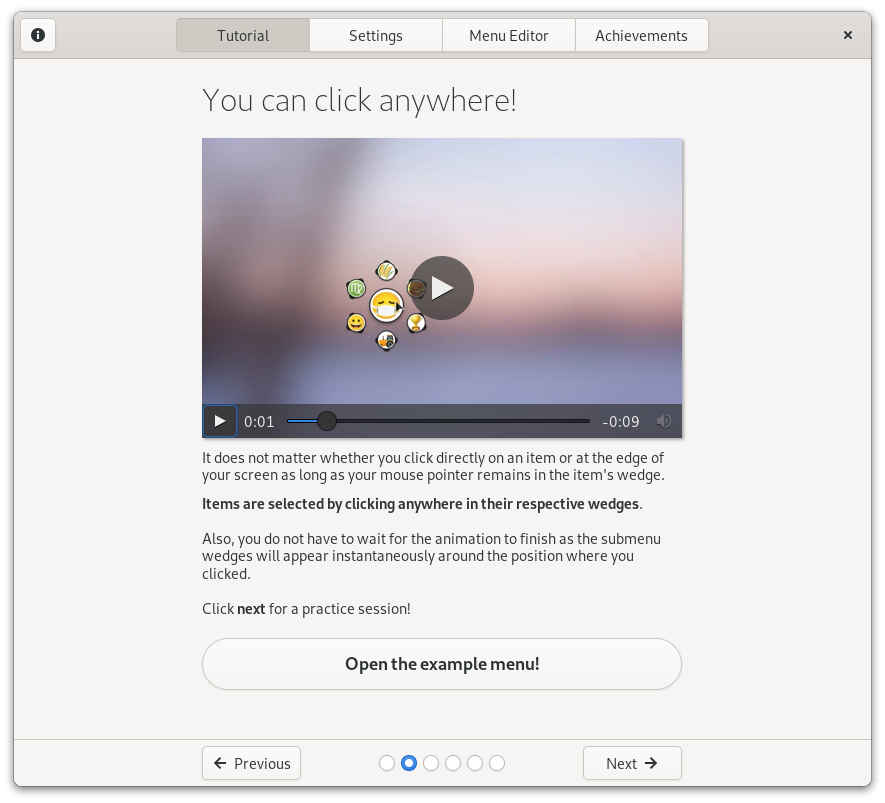
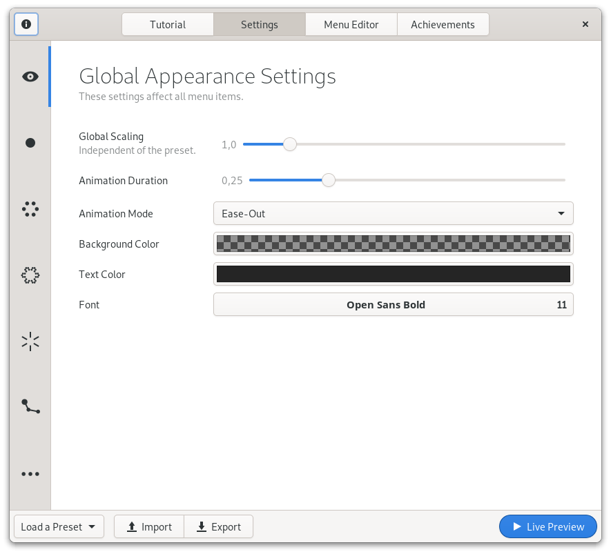

<p align="center">
  
</p>

# First Steps with Fly-Pie

The default menu can be opened with <kbd>Ctrl</kbd>+<kbd>Space</kbd>. You can use this to get used to Fly-Pie, however you should definitely create your own menus!

To open the settings dialog, you can use the `gnome-tweak-tool`, the `gnome-extensions-app` or this command:

```
gnome-extensions prefs flypie@schneegans.github.com
```

The configuration dialog of Fly-Pie has four pages.
On the first you will find the **tutorial**,
on the second you can define its **appearance**,
and on the third you can **define your own menus**.
The last one... well, we will come to this later!

### The Tutorial



Here are the main take-aways from the interactive tutorial:

* You can **click anywhere in an item's wedge**. It does not matter whether you click directly on an item or at the edge of your screen as long as you are in the same wedge.
* To enter **Marking Mode**, click and drag an item. As soon as you pause dragging or make a turn, the item will be selected. **This way you can select items with gestures!**
* Try remembering the path to an item. Open the menu and **draw the path with your mouse**. You can start with individual segments of the path, put you can also try to draw the entire path!
* You may find it more successful if you explicitly try to compose your gesture of straight parts. **Do not draw curvy paths but rather expressive zig-zag-lines!**
* You can also "draw" gestures as long as a modifier key, such as <kbd>Ctrl</kbd>, <kbd>Shift</kbd>, or <kbd>Alt</kbd> is held down **without having to press your mouse button**! This is especially useful when you opened the menu with a shortcut involving such a modifier key. You can just keep it pressed and move the pointer with the mouse or your touch-pad!




### The Settings Page


On the second page, you can adjust the appearance of Fly-Pie.
At the beginning, you may want to **load a preset** with the first button in the action bar at the bottom.

With the play-button you can always open a **live-preview** of your menu.
Just play around with the options, most of it should be more or less self-explanatory.

Once you are happy with your menu style, you can **export** the settings in order to switch between different themes.


### The Menu Editor


If you installed and enabled Fly-Pie for the very first time, you can bring up the default menu with <kbd>Ctrl</kbd> + <kbd>Space</kbd>.
The default menu may give you the opportunity to play around with Fly-Pie,
but you should definitely define your own menus!

_:information_source: **Tip:** If no menu shows up, you can execute the following command in a terminal, try again to open the menu and look for any errors.
This may print many unrelated messages, but using `grep` like this highlights all occurrences of `flypie`
which makes spotting Fly-Pie-related messages much easier._

```bash
journalctl -f -o cat | grep -E 'flypie|'
```


### The Last Page: Achievements!

<a href="https://youtu.be/Lj-uefp36Jk"></a>

To the best of my knowledge, Fly-Pie is the first GNOME Shell extension featuring achievements!
While you will not get any rewards (you will get fancy badges though!), this feature can motivate you to use Fly-Pie as efficiently as possible.

### Alternative Ways to Open Menus

There are two possibilities to open menus.
Either via the configured shortcut or with a terminal command as [described on the next page](dbus-interface.md).
This second approach can be used in combination with other tools.
Interesting companions are:

* [Custom Hot Corners - Extended](https://extensions.gnome.org/extension/4167/custom-hot-corners-extended/): Open menus by moving your mouse to one corner of your screen!
* [Input Remapper](https://github.com/sezanzeb/input-remapper/): Bind menus to your additional mouse buttons!
* [xbindkeys](http://www.nongnu.org/xbindkeys/xbindkeys.html): X11-only alternative to Input Remapper.
* [Easystroke](https://github.com/thjaeger/easystroke/wiki): X11 only, use mouse gestures to open menus!

<p align="center"></p>

<p align="center">
  
  <a href="installation.md"> Installation</a>
  
  <a href="../README.md#getting-started"> Index</a>
  
  <a href="dbus-interface.md">The D-Bus interface </a>
</p>
