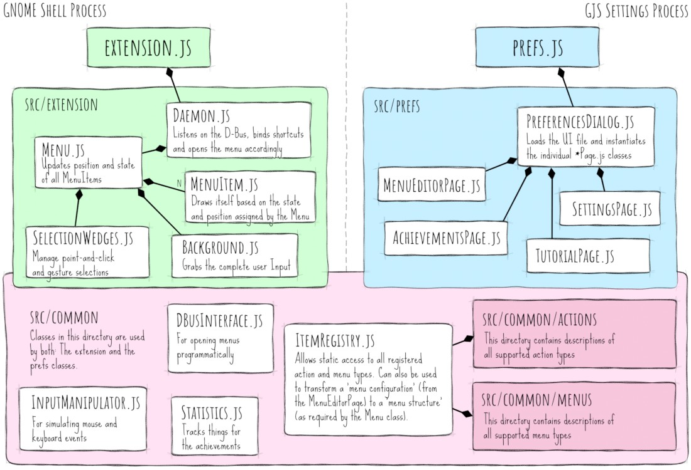
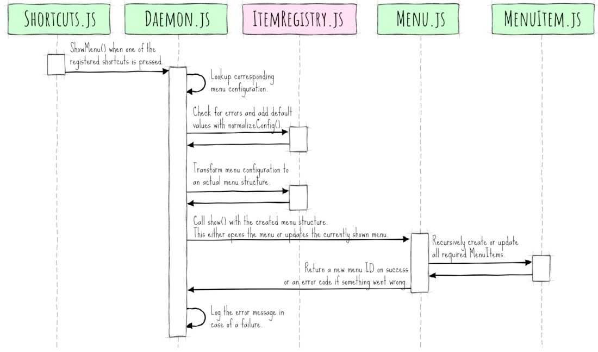

  

# Software Architecture of Fly-Pie

This page will give you an overview of the main classes of Fly-Pie, their relations and interactions.
The main purpose is to provide a high-level overview.
To learn the details, feel free to have a look at the source code, there are quite a lot of comments and explanations inside.

GNOME Shell extensions have two main entry files [`extension.js`](../extension.js) and [`prefs.js`](../prefs.js).
The methods of the former are called in GNOME Shell's process when the extension is enabled, the methods from the latter are called when the settings dialog of the extension is opened.
This happens in another process - any communication between these two parts usually happens via [GSettings](https://developer.gnome.org/gio/stable/GSettings.html).

## The [`src`](../src) Directory of Fly-Pie

The source directory of Fly-Pie reflects this aforementioned separation:
There is one subdirectory for classes which are only instantiated by [`extension.js`](../extension.js), one for [`prefs.js`](../prefs.js) and finally a subdirectory called [`src/common`](../src/common) which contains code called by both sides.

The following diagram shows the main classes contained in each of the three directories and their relationships.
In reality there are some more classes, but these are the most important ones:

 

  

 

## How Is a Menu Opened in Fly-Pie?

If you try to follow the execution flow of Fly-Pie, the first thing you may wonder is:
What happens until a menu is shown on the screen?

The main entry point is the [`Daemon.js`](../src/extension/Daemon.js) class.
It has four key methods (`ShowMenu()`, `PreviewMenu()`, `ShowCustomMenu()`, `PreviewCustomMenu()` which are exposed via Fly-Pie's [D-Bus Interface](dbus-interface.md).
The `ShowMenu()` method will also be called when one of the registered shortcuts is pressed.
In this case roughly the following happens:

  

If a Menu is edited in Fly-Pie's menu editor, the changes will be stored immediately.
The [`Daemon.js`](../src/extension/Daemon.js) listens for these changes and triggers the above sequence whenever the configuration changes.
This allows live-updating a menu even if there are two processes involved.

  <a href="contributing.md"> Contributing Guidelines</a>
  
  <a href="../README.md#getting-started"> Index</a>
  
  <a href="translating.md">Translating </a>
  

