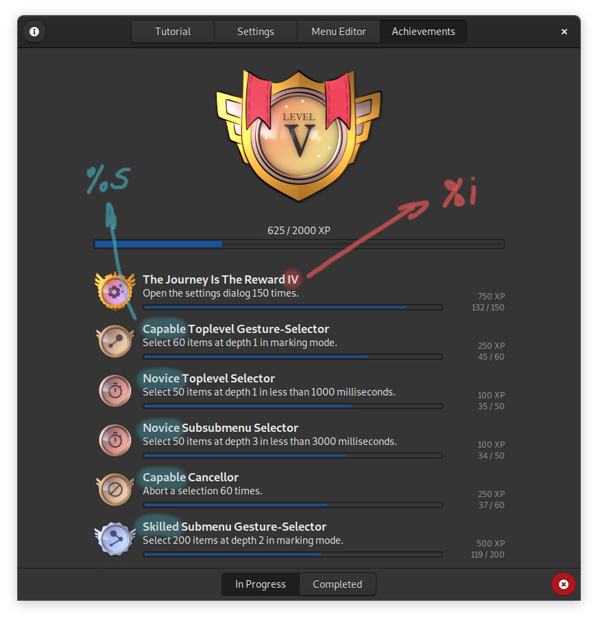

[](https://hosted.weblate.org/engage/fly-pie/)

# Translating Fly-Pie



A great way to contribute to Fly-Pie is creating a translation to another language! There are two ways, you can either use the [Weblate](https://hosted.weblate.org/engage/fly-pie/) online translation tool or standard offline tools such as [Poedit](https://poedit.net/) or the [GNOME Translation Editor](https://wiki.gnome.org/Apps/Gtranslator).

### General Remarks

While there are explanations for many source strings available, some may be still quite unclear.
Please open an issue on GitHub indicating which strings are not clear to you and we will add more explanations!

An especially challenging part for translations are the **achievements**.
Most achievements have five tiers.
In these cases, you can use a `%i` or a `%s` in the achievement's name.
In English, `%i` will be replaced by the corresponding roman tier number (I, II, III, ...) and `%s` will be replaced by one of the attributes ('Novice', 'Master', ...).
Both of these can be translated as well, so you may get quite creative here!
The image on the right illustrates this.

<p style="clear:both"></p>

## Translating Using Weblate (recommended)

Just head over to [Weblate](https://hosted.weblate.org/engage/fly-pie/) and start a new translation or update an existing one.
If you are logged in, you can directly edit the translations.
If you are not logged in, you can make suggestions for improving existing translations.

### Testing Your Translation

If you started a translation from scratch or modified substantial parts of an existing translation, you should verify that everything looks as supposed.
To do this, you should clone the [Weblate fork of Fly-Pie](https://github.com/weblate/Fly-Pie/tree/weblate-fly-pie-core) and install it:

```bash
git clone https://github.com/weblate/Fly-Pie.git
./Fly-Pie/scripts/create-release.sh -i
```
Then, restart GNOME Shell with <kbd>Alt</kbd> + <kbd>F2</kbd>, <kbd>r</kbd> + <kbd>Enter</kbd>.
Or logout / login if you are on Wayland.
If all strings you translated are looking good, you're done!
A pull request including your changes will be created automatically.

## Translating Using Offline Tools

If you do not want to use Weblate, you can also contribute to the translations of Fly-Pie using standard offline tools.
First you should [fork the Fly-Pie repository](https://github.com/schneegans/fly-pie/fork) and clone the latest `develop` branch from your fork. You can then install the extension by executing `scripts/create-release.sh -i`. Then restart GNOME Shell with <kbd>Alt</kbd> + <kbd>F2</kbd>, <kbd>r</kbd> + <kbd>Enter</kbd>.
Or logout / login if you are on Wayland.

* You can then start your contribution with the following command:

  ```bash
  scripts/update-po.sh -l <LANG-CODE> # <LANG-CODE>` is the language code for the
                                      # translation (`de` for German, `it` for Italian etc.)
  ```

* In case you are the first translator to a language, this script will create a `po/<LANG-CODE>.po` file for you.
Otherwise, it pulls the latest strings and merges them into the existing translation file.

* Now open the file and start translating! We suggest using a tool like
[Poedit](https://poedit.net/) or the [GNOME Translation Editor](https://wiki.gnome.org/Apps/Gtranslator).

* Once you are happy to test your translation, install the extension with your updated translations:

  ```bash
  scripts/create-release.sh -i
  ```

  Then, restart GNOME Shell with <kbd>Alt</kbd> + <kbd>F2</kbd>, <kbd>r</kbd> + <kbd>Enter</kbd>.
Or logout / login if you are on Wayland.

* Test if all strings you translated are looking good.
Then, you can add your new `*.po` file with a commit like `:globe_with_meridians: <Add/Update> <Language> translation`
and submit a pull request to the `develop` branch!

**To get started, have a look at the [Pull Request Template](.github/PULL_REQUEST_TEMPLATE/add_or_update_translation.md)**.
It provides a guideline on what to do in order to get your Pull Request accepted.
When creating your pull request, you can simply append a `&template=add_or_update_translation.md`
to the URL to auto-populate the body of your pull request with the template.

Please refer to [contributing.md](contributing.md) for further contribution guidelines.


<p align="center"></p>

<p align="center">
  <a href="software-architecture.md"> Software Architecture</a>
  
  <a href="../README.md#getting-started"> Index</a>
  
  <a href="creating-actions.md">Creating New Action Types </a>
</p>
